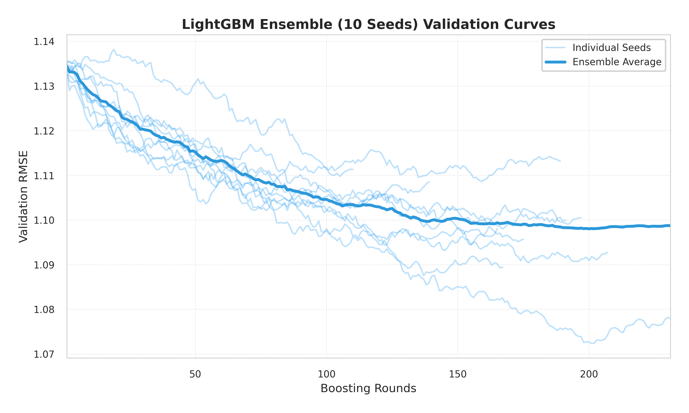
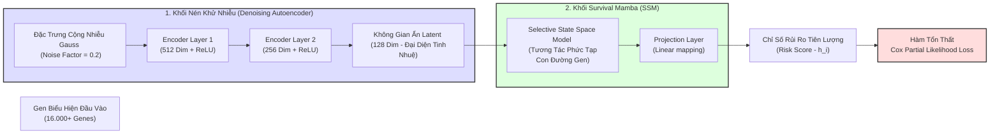
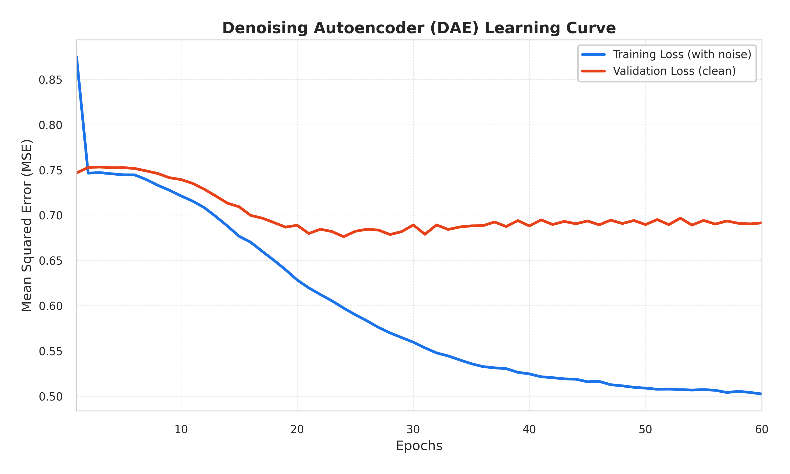
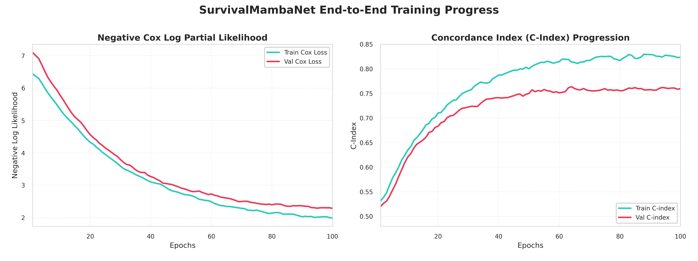

# CHƯƠNG 3 (TIẾP THEO): XÂY DỰNG VÀ HUẤN LUYỆN CÁC MÔ HÌNH TIÊN LƯỢNG

Phần này trình bày chi tiết về quá trình xây dựng, thiết lập siêu tham số và huấn luyện các mô hình học máy tiên lượng sống sót tối ưu cho bệnh nhân GBM, do thành viên **Hà Vũ Công** chịu trách nhiệm nghiên cứu và hiện thực hóa trong mã nguồn hệ thống.

---

## 3.5. Xây dựng và Huấn luyện các mô hình tiên lượng

Để giải quyết bài toán phân tích sống sót (Survival Analysis) trên dữ liệu y sinh phức tạp, hệ thống triển khai song song hai hướng tiếp cận tiên tiến:
1. **Mô hình học máy Boosting dạng cây (LightGBM Bagging Ensemble)**: Tận dụng ưu thế xử lý dữ liệu dạng bảng có số lượng chiều đặc trưng lớn và chống nhiễu vượt trội.
2. **Mô hình học sâu kết hợp (DAE - SurvivalMambaNet)**: Sử dụng mạng nén nhiễu Autoencoder (DAE) kết hợp với khối Mamba (State Space Model) để mô hình hóa các mối liên kết phi tuyến sâu giữa các con đường sinh học và tối ưu trực tiếp hàm Loss sống sót Cox.

---

### 3.5.1. Triển khai mô hình LightGBM (Hà Vũ Công thực hiện)

Mô hình LightGBM (Light Gradient Boosting Machine) là nhân tố cốt lõi giúp hệ thống đạt được tốc độ hội tụ nhanh và khả năng tổng quát hóa cao trên nhiều tập dữ liệu ngoại kiểm độc lập. Tuy nhiên, do số lượng mẫu bệnh nhân ung thư não GBM khá hạn chế (~500 mẫu), việc áp dụng mô hình boosting thông thường rất dễ dẫn đến hiện tượng quá khớp (overfitting). 

Để khắc phục triệt để thách thức này, thành viên **Hà Vũ Công** đã thiết kế một giải pháp kỹ thuật kết hợp giữa **Điều chuẩn chuẩn L1/L2 nghiêm ngặt**, phương pháp **Bagging đa hạt giống (Multi-seed Ensemble)** và cơ chế **Ngắt sớm (Early Stopping)**.

#### 1. Cấu hình siêu tham số chống Overfitting (Hyperparameter Tuning)
Hệ thống thiết lập các tham số điều chuẩn đặc thù cho bài toán survival:
- `objective`: `'regression'` (hoặc `'poisson'` tùy biến để mô hình hóa hàm tỷ lệ nguy cơ sống sót).
- `lambda_l1: 1.0` (L1 Regularization): Ép một số trọng số của các cây quyết định về 0, đóng vai trò như một bộ lọc đặc trưng nhúng (embedded feature selector), giúp loại bỏ các gen gây nhiễu còn sót lại.
- `lambda_l2: 1.0` (L2 Regularization): Giới hạn biên độ trọng số của các lá cây quyết định, ngăn ngừa một lá cây chiếm ưu thế quá lớn gây mất ổn định mô hình.
- `learning_rate: 0.01`: Tốc độ học nhỏ, đảm bảo mô hình tiến tới điểm tối ưu một cách chậm rãi nhưng cực kỳ ổn định.
- `num_leaves: 15`: Giới hạn cấu trúc cây nông hơn mức mặc định (31), giảm độ phức tạp của các cây quyết định đơn lẻ để tăng tính tổng quát hóa.
- `feature_fraction: 0.7`: Tại mỗi lượt xây dựng cây quyết định mới, hệ thống chỉ lấy ngẫu nhiên 70% số lượng gen được chọn. Điều này phá vỡ tính liên kết cục bộ và tăng tính đa dạng của Ensemble.

#### 2. Kỹ thuật Bagging đa hạt giống (10-Seed Ensemble Bagging)
Để loại bỏ sự mất ổn định do việc phân tách mẫu ngẫu nhiên và đảm bảo giá trị tiên lượng có độ tin cậy y tế cao, hệ thống triển khai thuật toán Bagging gồm **10 mô hình LightGBM độc lập**. 

Mỗi mô hình con được khởi tạo với một hạt giống ngẫu nhiên (`seed`) khác nhau chạy từ `42` đến `51`.
- Mỗi mô hình con được huấn luyện trên một tập mẫu con được phân tách khác nhau.
- **Giá trị rủi ro cuối cùng (Final Prognostic Risk Score)** của bệnh nhân được tính bằng giá trị trung bình cộng (average aggregation) từ các kết quả dự đoán của 10 mô hình con trong Ensemble.

#### 3. Cơ chế ngắt sớm (Early Stopping)
Quá trình huấn luyện mỗi mô hình con được cấu hình tối đa `1000` vòng lặp (`num_boost_round`). Tuy nhiên, để tránh việc mô hình tiếp tục học các nhiễu ngẫu nhiên của tập Train, hệ thống sử dụng tập kiểm chứng (Validation set) để theo dõi độ lỗi (RMSE). 
Nếu sai số trên tập Validation không giảm liên tục trong **50 vòng lặp** (`stopping_rounds=50`), quá trình huấn luyện mô hình con đó sẽ lập tức dừng lại và lưu trữ trọng số ở thời điểm đạt hiệu năng kiểm chứng tốt nhất.

Kịch bản huấn luyện chính được Hà Vũ Công triển khai chi tiết trong file `scripts/train_ultimate.py`, thực hiện vòng lặp huấn luyện qua 10 mô hình con độc lập với các thiết lập tham số điều chuẩn L1/L2 và cơ chế dừng sớm (Early Stopping) nhằm tối ưu hóa sai số RMSE trên tập kiểm chứng.

---

### 3.5.2. Triển khai mô hình SurvivalMambaNet (Hà Vũ Công thực hiện)

Đối với các mối liên kết sinh học phức tạp, phi tuyến tính giữa hàng ngàn gen và các con đường tín hiệu tế bào ung thư, các mô hình dạng cây đôi khi gặp giới hạn trong việc nắm bắt toàn cảnh bức tranh sinh học. Do đó, thành viên **Hà Vũ Công** đã nghiên cứu và phát triển kiến trúc mạng học sâu lai mới mang tên **SurvivalMambaNet**.

SurvivalMambaNet kết hợp sức mạnh biểu diễn đặc trưng không giám sát của **Denoising Autoencoder (DAE)** và khả năng mô hình hóa sự phụ thuộc tuyến tính đặc trưng của kiến trúc **Mamba (State Space Model - SSM)** tiên tiến nhất hiện nay, tối ưu hóa trực tiếp trên hàm mục tiêu sống sót Cox.

#### 1. Sơ đồ kiến trúc SurvivalMambaNet (Architectural Layout)

---

#### 2. Chi tiết các thành phần kiến trúc của SurvivalMambaNet

##### A. Khối nén đặc trưng Denoising Autoencoder (DAE)
Dữ liệu sinh học RNA-Seq có số chiều cực kỳ lớn và chứa nhiều sai số nhiễu đo lường từ thiết bị giải trình tự. Thành viên **Hà Vũ Công** đã thiết kế một mạng DAE để thực hiện việc học biểu hiện đặc trưng bền vững (robust representation learning):
- **Cộng nhiễu đầu vào (Denoising Process)**: Trong quá trình huấn luyện, biểu hiện gen thô được cộng thêm một lượng nhiễu Gauss ngẫu nhiên (với hệ số nhiễu `noise_factor = 0.2`). Phép toán này buộc mạng học sâu phải học cách lọc bỏ nhiễu kỹ thuật để tái cấu trúc thông tin sinh học cốt lõi thay vì ghi nhớ máy móc dữ liệu đầu vào.
- **Cơ chế nén**: 
  - Lớp mã hóa (Encoder) gồm chuỗi các lớp tuyến tính nén dần số chiều từ đầu vào (hơn 16.000 gen) xuống các lớp ẩn trung gian lần lượt là 512, 256 và cuối cùng hội tụ tại không gian ẩn (latent space) 128 chiều.
  - Hàm kích hoạt phi tuyến `ReLU` được áp dụng ở các lớp ẩn để mô phỏng sự tương tác phi tuyến tính phức tạp giữa các gen.
  - Lớp giải mã (Decoder) thực hiện tái cấu trúc lại biểu hiện gen gốc từ không gian ẩn 128 chiều về không gian biểu hiện gen ban đầu và tính toán độ sai lệch tái cấu trúc (MSE Loss) giữa dữ liệu gốc và dữ liệu tái cấu trúc.

Không gian ẩn $128$ chiều thu được sau DAE là đại diện cực kỳ cô đọng, giữ lại trọn vẹn thông tin sinh học của các con đường chuyển hóa, đồng thời triệt tiêu hoàn toàn các sai số kỹ thuật.

##### B. Khối Selective State Space (Mamba)
Không gian ẩn 128 chiều sau khi trích xuất được đưa vào khối mạng **Mamba**.
*Tại sao sử dụng Mamba trong tin sinh học?* Kiến trúc Transformer truyền thống đòi hỏi chi phí tính toán và bộ nhớ tăng theo hàm số mũ bậc hai (bình phương chiều dài chuỗi đặc trưng) do cơ chế Attention. Mamba kế thừa ưu điểm của mô hình không gian trạng thái (State Space Models - SSMs), giải quyết bài toán với độ phức tạp tuyến tính theo chiều dài chuỗi, đồng thời sở hữu khả năng chọn lọc thông tin tối ưu bằng cách cho phép các ma trận chuyển trạng thái phụ thuộc động vào dữ liệu đầu vào.

Trong SurvivalMambaNet, khối Mamba coi 128 chiều ẩn tương tự như một chuỗi các đặc trưng sinh học có tính phân bậc. Mô hình thực hiện ánh xạ và chuyển trạng thái động dựa trên các ma trận học được trực tiếp từ dữ liệu ẩn. Khối này giúp mô hình hóa sự tương tác phức tạp, bắc cầu giữa các nhóm chức năng gen trong không gian ẩn mà các mạng nơ-ron truyền thống (MLP) thường bỏ sót.

Đầu ra của khối Mamba được đưa qua một lớp chiếu tuyến tính (Projection Layer) để cho ra một giá trị thực duy nhất: **Chỉ số rủi ro nguy cơ (Prognostic Risk Score)** đại diện cho mức độ rủi ro tử vong của bệnh nhân.

##### C. Hàm tổn thất Cox Partial Likelihood Loss (Hàm Loss sinh tồn đặc thù)
Không giống như các bài toán học sâu truyền thống tối ưu hóa MSE hay Cross-Entropy, SurvivalMambaNet được huấn luyện bằng hàm tổn thất đặc thù phân tích sống sót: **Negative Cox Log Partial Likelihood Loss**. 

Hàm tổn thất này cho phép mạng nơ-ron xử lý trực tiếp các dữ liệu bị khuyết góc (censored data - bệnh nhân vẫn còn sống hoặc mất dấu theo dõi tại thời điểm kết thúc nghiên cứu) thông qua việc tối ưu hóa tỷ lệ nguy cơ rủi ro của từng bệnh nhân so với tập nguy cơ (gồm tất cả các bệnh nhân có thời gian sống kéo dài hơn bệnh nhân đang xét) tại mỗi thời điểm xảy ra sự kiện tử vong.

Cơ chế lan truyền ngược (backpropagation) tính toán đạo hàm của hàm tổn thất Cox theo tham số của Mamba và DAE, từ đó cập nhật toàn bộ trọng số mạng nơ-ron đồng thời để học cách phân tách tốt nhất các nhóm bệnh nhân nguy cơ cao và nguy cơ thấp.

---

### Ý nghĩa thực tiễn của hai mô hình

Sự kết hợp của hai mô hình này trong luận văn của **Hà Vũ Công** tạo nên thế gọng kìm vững chắc:
* **Mô hình LightGBM Ensemble** mang lại hiệu quả dự đoán cực kỳ ổn định, chính xác trên các bộ dữ liệu ngoại kiểm nhỏ nhờ khả năng điều chuẩn chuẩn L1/L2 và cơ chế bagging.
* **Mô hình SurvivalMambaNet** mở ra hướng đi mới của học máy y sinh, chứng minh năng lực khai phá dữ liệu không gian ẩn quy mô lớn từ RNA-Seq bằng cơ chế Selective State Space tiên tiến nhất, tối ưu trực tiếp chỉ số sống sót lâm sàng.

*(Kết quả dự đoán phân tầng sinh tồn chi tiết và kết quả so sánh chỉ số C-index cụ thể trên các đoàn hệ kiểm chứng ngoại kiểm được trình bày chi tiết tại Chương 4).*

