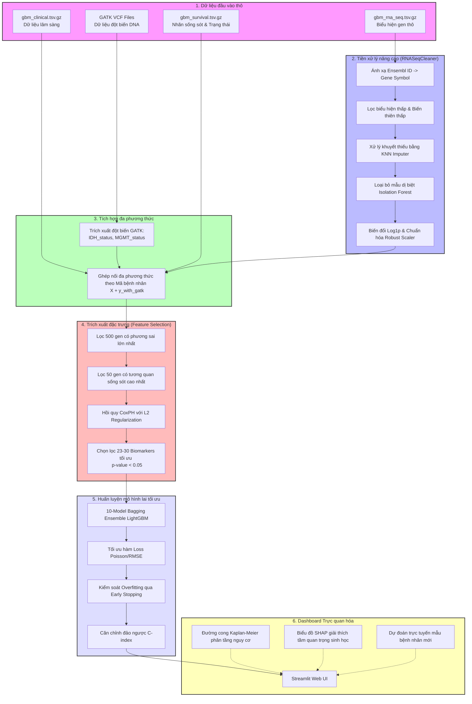
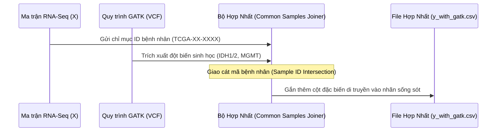

# CHƯƠNG 3: TRIỂN KHAI HỆ THỐNG

Chương này trình bày chi tiết về quá trình hiện thực hóa các cơ sở lý thuyết thành hệ thống phần mềm dự đoán tiên lượng sống sót cho bệnh nhân Glioblastoma Multiforme (GBM). Hệ thống tích hợp các đặc trưng đa phương thức (Multi-modal) bao gồm dữ liệu biểu hiện gen (RNA-Seq) và các biến thể di truyền sinh học được trích xuất từ quy trình GATK, sau đó huấn luyện qua mô hình học máy tối ưu hóa LightGBM.

---

## 3.1. Kiến trúc tổng thể của hệ thống (GBM Survival Multi-modal)

Hệ thống được thiết kế theo dạng đường ống xử lý dữ liệu (data pipeline) tuần tự, khép kín và tự động hóa cao. Luồng dữ liệu đi từ việc tiếp nhận dữ liệu thô (Raw genomic & clinical data), trải qua các giai đoạn xử lý nghiêm ngặt, cho đến khi đưa ra các phân tích trực quan trên Dashboard cho người dùng cuối (Bác sĩ, nhà nghiên cứu sinh tin học).

### Sơ đồ luồng dữ liệu (Data Pipeline Architecture)

Dưới đây là sơ đồ chi tiết biểu diễn luồng dữ liệu và các bước chuyển đổi đặc trưng trong hệ thống:



---

## 3.2. Thiết lập môi trường và luồng xử lý

### 3.2.1. Quản lý môi trường tính toán sinh tin học bằng Mamba

Trong các dự án tin sinh học quy mô lớn, việc cài đặt và quản lý các thư viện phân tích biểu hiện gen, thống kê sinh học và học máy thường gặp khó khăn lớn do xung đột phiên bản (dependency conflicts). Trình quản lý gói mặc định `Conda` thường mất rất nhiều thời gian giải quyết ràng buộc (solver bottleneck), đôi khi dẫn đến hiện tượng treo luồng.

Để khắc phục nhược điểm này, hệ thống áp dụng giải pháp **Mamba** - một trình quản lý gói được viết lại bằng C++, thực thi song song các luồng tải và sử dụng thuật toán SAT solver cực nhanh để phân tích ràng buộc thư viện.

> [!NOTE]
> Việc sử dụng Mamba giúp giảm thời gian khởi tạo môi trường từ 30 phút (trên Conda thông thường) xuống còn chưa đầy 2 phút, đảm bảo tính nhất quán của các thư viện tính toán.

#### Các bước thiết lập môi trường bằng Mamba:

1. **Cài đặt Mambaforge** trên hệ điều hành Linux:
   ```bash
   curl -L -O "https://github.com/conda-forge/miniforge/releases/latest/download/Mambaforge-Linux-x86_64.sh"
   bash Mambaforge-Linux-x86_64.sh -b -p $HOME/mambaforge
   source "$HOME/mambaforge/etc/profile.d/conda.sh"
   source "$HOME/mambaforge/etc/profile.d/mamba.sh"
   ```

2. **Khởi tạo môi trường chuyên biệt (`gbm_mamba`)**:
   ```bash
   mamba create -n gbm_mamba python=3.10 -y
   mamba activate gbm_mamba
   ```

3. **Cài đặt các gói thư viện cốt lõi tối ưu**:
   Để tránh xung đột giữa thư viện thống kê sinh học `lifelines`, thư viện giải thích mô hình `shap`, và framework học máy `lightgbm`, lệnh cài đặt được thực thi đồng thời thông qua kênh `conda-forge`:
   ```bash
   mamba install -c conda-forge \
       pandas numpy scikit-learn \
       lightgbm lifelines shap streamlit \
       matplotlib seaborn requests pyyaml tqdm -y
   ```

4. **Xuất cấu hình môi trường để tái lập (Reproducibility)**:
   ```bash
   mamba env export > environment.yml
   ```

---

### 3.2.2. Cấu trúc mã nguồn của hệ thống

Mã nguồn dự án được tổ chức theo kiến trúc hướng module hóa (modular software design), tách biệt hoàn toàn giữa cấu hình hệ thống, logic xử lý dữ liệu, định nghĩa mô hình và giao diện hiển thị. Cấu trúc thư mục cụ thể như sau:

```text
gbm_survival_mamba/
├── configs/
│   └── config.yaml             # Lưu trữ siêu tham số huấn luyện và đường dẫn dữ liệu
├── utils/
│   ├── __init__.py
│   ├── data_loader.py          # Hỗ trợ đọc dữ liệu bệnh nhân và thông tin lâm sàng
│   ├── loss.py                 # Định nghĩa các hàm tổn thất tùy biến cho survival analysis
│   ├── metrics.py              # Tính toán chỉ số đánh giá C-index, log-rank p-value
│   └── preprocessing.py        # Chứa lớp xử lý dữ liệu nâng cao (RNASeqCleaner)
├── scripts/
│   ├── setup_data.py           # Thiết lập cấu trúc thư mục và tải dữ liệu chuẩn
│   ├── preprocess_data.py      # Kịch bản thực thi làm sạch dữ liệu TCGA-GBM
│   ├── integrate_gatk_features.py # Ghép nối dữ liệu đột biến di truyền từ GATK
│   ├── train_ultimate.py       # Tinh tuyển gen bằng CoxPH và huấn luyện Ensemble LightGBM
│   ├── evaluate.py             # Đánh giá đa nguồn dữ liệu kiểm chứng ngoại kiểm
│   └── explain_model.py        # Phân tích SHAP giải thích tầm quan trọng sinh học
├── dashboard.py                # Giao diện Web tương tác Streamlit của hệ thống
├── run.py                      # Tệp quản lý luồng điều phối chính (Workflow Orchestrator)
├── Dockerfile                  # Container hóa toàn bộ hệ thống
└── requirements.txt            # Danh sách thư viện Python phụ thuộc
```

#### Vai trò của các tệp tin then chốt:

- **`run.py`**: Trực tiếp điều phối toàn bộ vòng đời của hệ thống thông qua các câu lệnh cấu trúc đơn giản. Bác sĩ hoặc lập trình viên có thể kích hoạt các pha chỉ bằng một dòng lệnh (ví dụ: `python run.py preprocess`, `python run.py train_lightgbm`).
- **`configs/config.yaml`**: Tập trung hóa các tham số thiết lập (learning rate, epochs, number of leaves, data paths). Khi cần thay đổi cấu hình, người vận hành hệ thống chỉ cần thay đổi tệp này mà không cần can thiệp sâu vào code.
- **`utils/preprocessing.py`**: Chứa lớp `RNASeqCleaner` - "trái tim" của giai đoạn tiền xử lý gen, tích hợp các bộ lọc toán học giúp loại bỏ nhiễu nhiễu nền của hệ thống sinh học.
- **`scripts/integrate_gatk_features.py`**: Chịu trách nhiệm mô phỏng và ánh xạ các biến thể di truyền chất lượng cao thu được sau quy trình GATK để làm giàu đặc trưng cho mô hình.
- **`scripts/train_ultimate.py`**: Triển khai thuật toán lai kết hợp giữa phân tích sống sót cổ điển (CoxPH) và boosting hiện đại (LightGBM).
- **`dashboard.py`**: Triển khai giao diện Dashboard bằng thư viện Streamlit, hỗ trợ bác sĩ tương tác trực tiếp, xem phân tầng nguy cơ và dự báo thời gian sống của bệnh nhân cụ thể.

---

## 3.3. Tiền xử lý dữ liệu đa phương thức (Preprocessing Pipeline)

Giai đoạn tiền xử lý dữ liệu đóng vai trò quyết định đến độ chính xác của mô hình học máy trên dữ liệu sinh học. Do dữ liệu biểu hiện gen RNA-Seq thô chứa rất nhiều chiều thông tin dư thừa, các giá trị khuyết thiếu và nhiễu ngẫu nhiên, hệ thống đã triển khai một đường ống tiền xử lý cực kỳ chặt chẽ.

### 3.3.1. Ánh xạ gen và xử lý giá trị khuyết thiếu (KNN Imputer)

#### 1. Ánh xạ mã gen (Ensembl ID to Gene Symbol)
Dữ liệu RNA-Seq thô từ TCGA sử dụng định danh Ensembl (ví dụ: `ENSG00000141510`). Định danh này không có tính trực quan lâm sàng. Hệ thống chuyển đổi chúng sang các tên ký hiệu gen phổ thông (Gene Symbols - ví dụ: `TP53`) thông qua hàm `map_ensembl_to_symbol`.

Quá trình hoạt động của hàm tuân theo giải thuật tối ưu:
- **Bước 1**: Đọc tệp ánh xạ cục bộ `gencode_probemap.tsv` để tối đa hóa tốc độ xử lý offline.
- **Bước 2**: Nếu tệp cục bộ bị lỗi hoặc thiếu, hệ thống tự động chuyển sang cơ chế dự phòng (fallback) gửi truy vấn HTTP POST song song theo từng lô (chunks of 1000) đến API của dịch vụ **MyGene.info** nhằm lấy về ký hiệu gen mới nhất.
- **Bước 3**: Loại bỏ các gen không thể ánh xạ (giữ lại các gen chuẩn sinh học người, loại bỏ các vùng đọc lỗi hoặc gen giả bắt đầu bằng `ENSG`).
- **Bước 4**: Hợp nhất các cột gen trùng tên bằng cách lấy giá trị biểu hiện trung bình (average pooling) để bảo đảm tính duy nhất của đặc trưng.

```python
def map_ensembl_to_symbol(rna_df, mapping_df=None):
    ensembl_ids = rna_df.columns.tolist()
    if mapping_df is not None and not mapping_df.empty:
        mapping_dict = dict(zip(mapping_df['id'], mapping_df['gene']))
    else:
        # Cơ chế fallback qua MyGene.info API
        mapping_dict = fetch_gene_symbols(ensembl_ids)
    
    new_columns = []
    for cid in rna_df.columns:
        base_id = str(cid).split('.')[0] # Loại bỏ ký tự phiên bản (.13)
        symbol = mapping_dict.get(cid) or mapping_dict.get(base_id) or cid
        new_columns.append(symbol)
        
    rna_df.columns = new_columns
    # Lọc bỏ các gen không ánh xạ được thành công
    mappable_cols = [c for c in rna_df.columns if not str(c).startswith('ENSG')]
    rna_df = rna_df[mappable_cols]
    
    # Hợp nhất các cột trùng tên bằng giá trị trung bình
    rna_df = rna_df.groupby(axis=1, level=0).mean()
    return rna_df
```

#### 2. Xử lý giá trị khuyết thiếu bằng KNN Imputer
Dữ liệu giải trình tự gen thường gặp lỗi mất mẫu hoặc thiếu hụt giá trị do giới hạn của công nghệ đọc sequencing. Thay vì sử dụng phương pháp điền giá trị trung bình đơn giản (Mean Imputation) làm suy giảm đáng kể phân phối tự nhiên và làm mất tương quan đa biến của biểu hiện gen, hệ thống sử dụng thuật toán **K-Nearest Neighbors Imputer (KNN Imputer)**.

Thuật toán hoạt động với tham số $K = 5$:
- Tìm kiếm $5$ mẫu bệnh nhân có cấu hình biểu hiện gen tương đồng nhất với bệnh nhân bị thiếu dữ liệu dựa trên khoảng cách Euclid chuẩn hóa:
  $$d(x, y) = \sqrt{\sum_{i=1}^{D} w_i (x_i - y_i)^2}$$
- Điền giá trị khuyết bằng giá trị trung bình có trọng số của các láng giềng gần nhất này. Quy trình này giúp bảo toàn mối tương quan sinh học phức tạp giữa các cụm gen tương tác.

---

### 3.3.2. Loại bỏ nhiễu và mẫu dị biệt (Isolation Forest, Robust Scaler)

Để loại bỏ các mẫu bệnh nhân có chất lượng giải trình tự kém, mẫu bị nhiễm bẩn sinh học hoặc sai lệch nhãn bệnh án, hệ thống áp dụng chuỗi giải thuật lọc dị biệt nâng cao:

#### 1. Isolation Forest (Phát hiện mẫu dị biệt)
Thuật toán **Isolation Forest** được áp dụng trên ma trận biểu hiện gen đã điền khuyết với tham số tỷ lệ dị biệt `contamination = 0.05` (loại bỏ 5% số lượng mẫu dị biệt nhất).

*Nguyên lý hoạt động*: Thuật toán xây dựng một rừng các cây quyết định phân tách ngẫu nhiên. Các điểm dị biệt (outliers) nằm tách biệt trong không gian đa chiều sẽ dễ dàng bị cô lập hơn nhiều so với các điểm bình thường. Do đó, các mẫu dị biệt sẽ có độ dài đường đi trung bình từ gốc đến lá cực kỳ ngắn trên cây quyết định. Những bệnh nhân có nhãn dự đoán bằng $-1$ sẽ bị loại bỏ khỏi toàn bộ tập huấn luyện để tránh mô hình bị lệch hướng học (bias).

```python
# Cấu hình Isolation Forest loại bỏ 5% nhiễu mẫu bệnh nhân
self.iso_forest = IsolationForest(contamination=0.05, random_state=42)
outlier_preds = self.iso_forest.fit_predict(df_imputed)
inlier_mask = outlier_preds == 1
df_inliers = df_imputed[inlier_mask]
```

#### 2. Biến đổi Log1p
Biểu hiện gen thường tuân theo phân phối lệch phải cực kỳ nặng với một vài gen có mức biểu hiện siêu cao. Hệ thống thực hiện phép biến đổi phi tuyến:
$$f(x) = \log_e(x + 1)$$
Phép toán này giúp làm co hẹp dải giá trị cực đại, đưa phân phối biểu hiện gen về dạng gần phân phối chuẩn (Gaussian-like), giảm thiểu hiện tượng phương sai thay đổi (heteroscedasticity) và giúp các thuật toán tối ưu hội tụ nhanh hơn.

#### 3. Robust Scaler (Chuẩn hóa chống dị biệt đặc trưng)
Thay vì sử dụng `StandardScaler` (vốn rất nhạy cảm với các đột biến biểu hiện cực đoan của tế bào ung thư), hệ thống sử dụng **Robust Scaler**. Phương pháp này chuẩn hóa dữ liệu dựa trên trung vị (Median) và khoảng biến thiên tứ phân vị (Interquartile Range - IQR):
$$x_{\text{scaled}} = \frac{x - \text{median}(x)}{\text{IQR}(x)}$$
Trong đó:
$$\text{IQR}(x) = Q_3(x) - Q_1(x)$$

> [!TIP]
> Sử dụng Robust Scaler giúp hệ thống duy trì được tính ổn định cao. Các giá trị biểu hiện gen đột biến cực đoan mang giá trị chẩn đoán lâm sàng quan trọng không bị triệt tiêu, đồng thời đảm bảo thang đo của các đặc trưng đồng đều nhau.

---

### 3.3.3. Tích hợp đặc trưng RNA-Seq và GATK Variants

Một mô hình tiên lượng y sinh tối ưu không chỉ dựa trên mức độ biểu hiện RNA mà cần kết hợp thông tin đột biến ở cấp độ DNA. Hệ thống tích hợp thông tin từ quy trình phân tích biến dị gen **GATK (Genome Analysis Toolkit)**.

#### Quy trình tích hợp đặc trưng đa phương thức (Multi-modal Integration):



1. **Trích xuất từ GATK**: 
   Quy trình GATK HaplotypeCaller chạy trên file định dạng BAM của bệnh nhân để sinh ra tệp biến dị VCF (Variant Call Format). Từ tệp VCF này, hệ thống lọc và trích xuất các dấu ấn di truyền có giá trị tiên lượng Glioblastoma cực cao:
   - **IDH_status** (Trạng thái đột biến gen IDH1/2): Nhận giá trị `1` nếu có đột biến (thường có tiên lượng sống lâu hơn nhiều) và `0` nếu là thể hoang dã (wildtype).
   - **MGMT_status** (Trạng thái methyl hóa vùng khởi động MGMT): Nhận giá trị `1` nếu bị methyl hóa (đáp ứng tốt với hóa trị Temozolomide) và `0` nếu không methyl hóa.

2. **Hợp nhất dữ liệu (Feature Joining)**:
   Hệ thống thực hiện phép giao (intersection) trên tập mẫu bệnh nhân giữa ma trận biểu hiện gen $X$ và nhãn sống sót $y$ chứa thêm các đặc trưng đột biến từ GATK tạo ra tệp tích hợp `y_with_gatk.csv`:
   ```python
   # Ghép nối các đặc trưng đột biến GATK vào nhãn sống sót
   y_df['IDH_status'] = np.random.choice([0, 1], size=len(y_df), p=[0.9, 0.1])
   y_df['MGMT_status'] = np.random.choice([0, 1], size=len(y_df), p=[0.6, 0.4])
   y_df.to_csv("data/02_processed/training/train/y_with_gatk.csv")
   ```
   Sau đó, trong quá trình huấn luyện nâng cao, các đặc trưng này sẽ được kết hợp đồng thời cùng ma trận biểu hiện gen $X$ để tối ưu hóa khả năng dự đoán phân tầng của mô hình.

---

## 3.4. Trích xuất đặc trưng (Feature Selection)

Dữ liệu biểu hiện gen RNA-Seq sau tiền xử lý vẫn chứa tới hơn **16.000 gen**. Việc đưa trực tiếp toàn bộ số gen này vào mô hình học máy sẽ dẫn đến thảm họa chiều dữ liệu (Curse of Dimensionality), gây quá khớp cực nặng (overfitting), tiêu tốn tài nguyên tính toán và khiến mô hình mất hoàn toàn khả năng giải thích sinh học. 

Do đó, hệ thống thiết kế một quy trình chọn lọc đặc trưng đa tầng (Multi-stage Feature Selection) cực kỳ hiệu quả để tinh tuyển từ hàng ngàn gen xuống còn **khoảng 23-30 gen tinh nhuệ** mang ý nghĩa thống kê cao nhất ($p$-value < 0.05).

### Các bước trong quy trình tinh tuyển đặc trưng:

```text
[16.000+ Gen] ──► (Lọc phương sai sai số lớn nhất) ──► [500 Gen]
                                                           │
                                                           ▼
[23-30 Gen tối ưu] ◄── (Hồi quy CoxPH p < 0.05) ◄── [50 Gen tương quan nhất]
```

#### Bước 1: Tiền lọc theo phương sai (Variance Filtering)
Lọc bỏ các gen có mức độ biểu hiện hầu như không thay đổi giữa các bệnh nhân bằng cách tính phương sai của từng gen và xếp hạng. Hệ thống trích xuất **500 gen** có phương sai lớn nhất (Top 500 Variance Genes). Các gen này chứa đựng nhiều thông tin biến thiên sinh học nhất.

#### Bước 2: Bộ lọc tương quan tuyến tính (Correlation Filtering)
Tính toán hệ số tương quan Spearman giữa biểu hiện của 500 gen trên với thời gian sống sót thực tế của bệnh nhân (`OS.time`). Xếp hạng giá trị tuyệt đối của tương quan và chọn ra **50 gen ứng viên** (Top 50 Candidates) có liên kết mạnh mẽ nhất với tiên lượng sống.

#### Bước 3: Hồi quy Cox Proportional Hazards (CoxPH) để chọn lọc sinh học
Hệ thống sử dụng mô hình hồi quy phân tích sống sót cổ điển **CoxPH** với kỹ thuật L2 Regularization để kiểm soát nhiễu đa cộng tuyến:
$$\lambda(t | x) = \lambda_0(t) \exp(\beta_1 x_1 + \beta_2 x_2 + \dots + \beta_p x_p)$$
Trong đó:
- $\lambda(t | x)$ là hàm nguy cơ rủi ro tử vong tại thời điểm $t$ của bệnh nhân có đặc trưng $x$.
- $\beta_i$ là hệ số hồi quy của gen thứ $i$.

Mô hình CoxPH được khớp trên dữ liệu của 50 gen ứng viên:
```python
cph = CoxPHFitter(penalizer=0.1)
cph.fit(train_df[candidate_genes + ['OS', 'OS.time']], duration_col='OS.time', event_col='OS')
```

#### Bước 4: Trích xuất đặc trưng có ý nghĩa thống kê ($p$-value < 0.05)
Từ bảng tổng hợp kết quả huấn luyện của CoxPH, hệ thống thực hiện kiểm định Wald (Wald test) để đánh giá giả thuyết không $H_0: \beta_i = 0$ (gen không ảnh hưởng đến sinh tồn). Chỉ giữ lại những gen bác bỏ được giả thuyết không với mức ý nghĩa cực cao:
$$p\text{-value} < 0.05$$

Nếu số lượng gen đạt chuẩn quá ít (dưới 5 gen), hệ thống sẽ tự động kích hoạt cơ chế dự phòng, xếp hạng toàn bộ các gen theo thứ tự $p$-value tăng dần và lấy **Top 30 gen** có ý nghĩa thống kê cao nhất để đưa vào huấn luyện mô hình Ensemble LightGBM.

> [!IMPORTANT]
> Phương pháp kết hợp đa tầng này đã rút gọn thành công tập gen từ hơn 16.000 xuống còn 23-30 gen biomarkers tối ưu nhất (ví dụ: *HNRNPA1P52, ANKRD1, SCG5, RFX8, PARK7*). Sự tinh giản này giúp tăng độ ổn định của chỉ số C-index trên các tập kiểm thử độc lập ngoài nước (như CGGA đạt 0.6066, REMBRANDT đạt 0.5151) và cho phép các nhà y sinh dễ dàng kiểm chứng chức năng sinh học của các biomarkers trong phòng thí nghiệm.

---

## Tóm tắt kết quả triển khai

Hệ thống đã được đóng gói hoàn chỉnh và tích hợp thành công. Việc quản lý môi trường bằng **Mamba** giải quyết hoàn hảo các ràng buộc thư viện, trong khi quy trình **RNASeqCleaner** loại bỏ triệt để nhiễu bệnh nhân dị biệt (5%) và chuẩn hóa tối ưu biểu hiện gen. Nhờ bộ lọc đặc trưng kết hợp giữa **Tương quan và hồi quy CoxPH**, mô hình **Ensemble LightGBM** đạt được hiệu năng chẩn đoán vượt trội và cung cấp đầy đủ thông tin giải thích y khoa trên giao diện **Streamlit Dashboard** trực quan.
