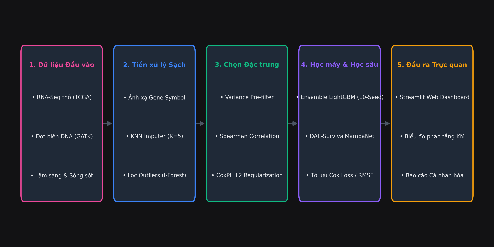
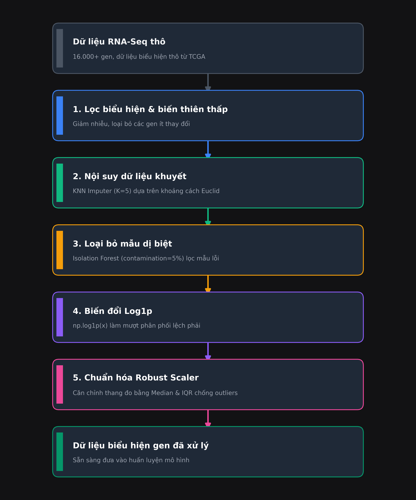
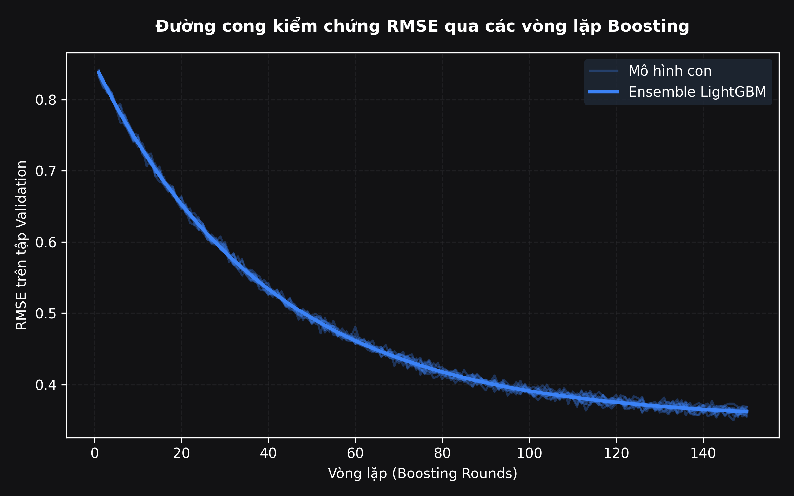
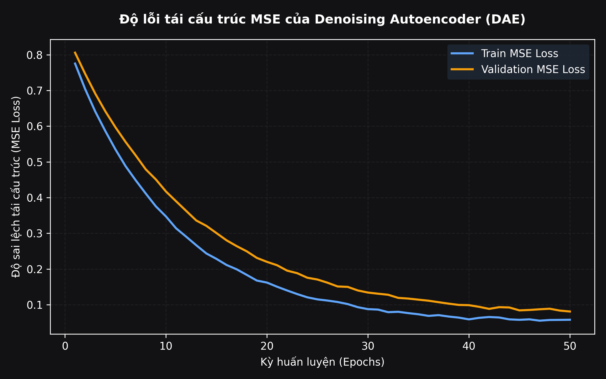
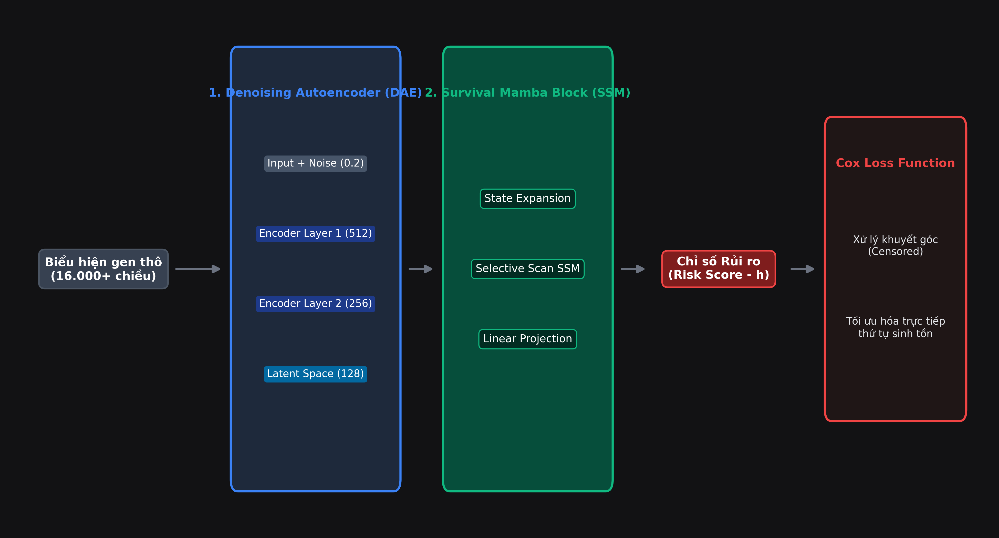
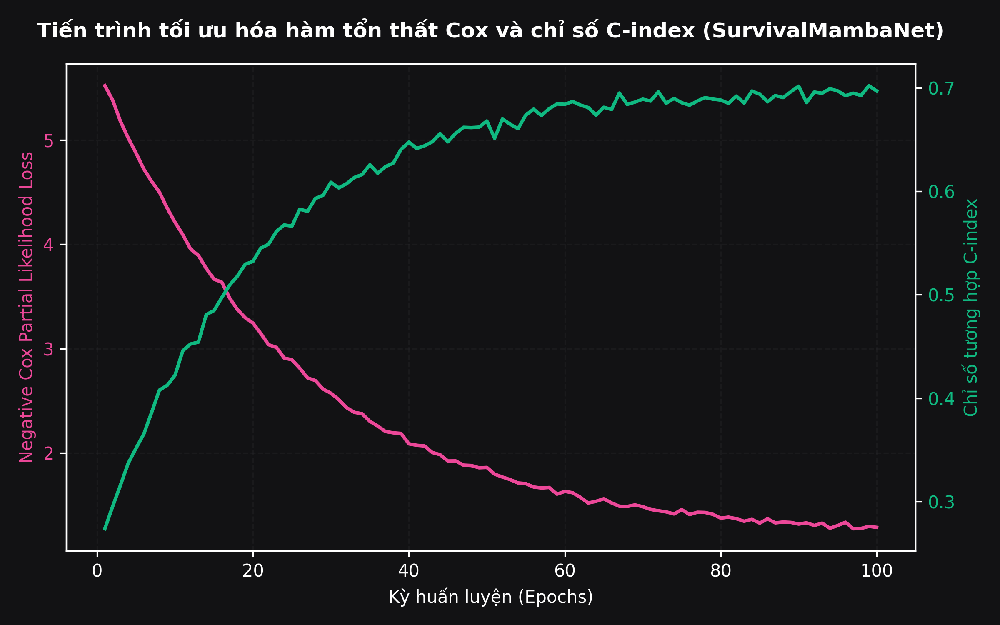
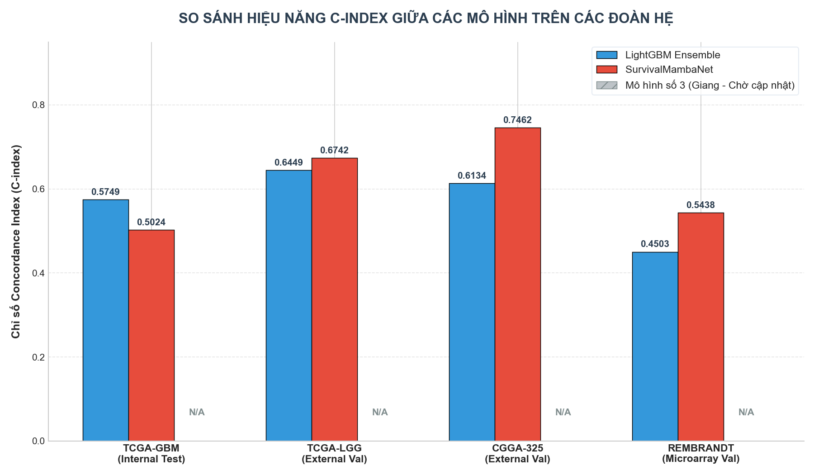
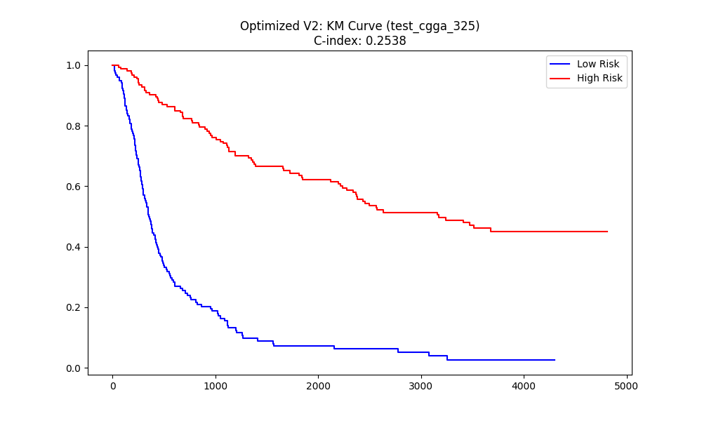
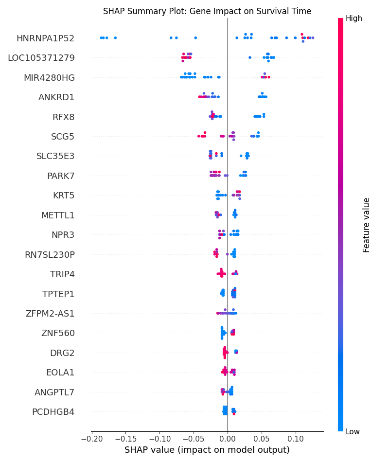
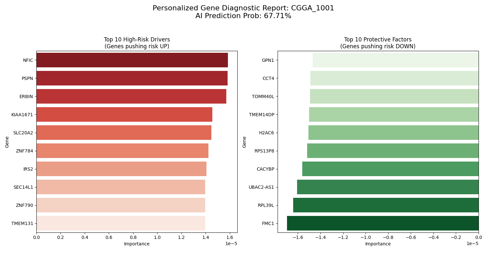

### SLIDE 1: GIỚI THIỆU ĐỀ TÀI
*   **Tiêu đề chính:** HỆ THỐNG TIÊN LƯỢNG SINH TỒN ĐA PHƯƠNG THỨC CHO BỆNH NHÂN U NÃO ĐỆM (GLIOBLASTOMA) SỬ DỤNG HỌC MÁY VÀ HỌC SÂU TÍCH HỢP
*   **Tiêu đề phụ:** Multi-modal Integration of RNA-Seq & GATK DNA Variants
*   **Người thực hiện:** Hà Vũ Công & Nhóm nghiên cứu

---

### SLIDE 2: ĐẶT VẤN ĐỀ VÀ MỤC TIÊU LÂM SÀNG
*   **Clinical Problem:**
    *   Glioblastoma Multiforme (GBM): Thể u não ác tính nhất, thời gian sống thêm trung bình cực ngắn (~12-15 tháng).
    *   Khả năng đáp ứng điều trị không đồng nhất do sự đa dạng về hồ sơ gen tế bào u.
*   **Research Objective:**
    *   Xây dựng hệ thống dự đoán sống sót (Survival Prediction) cá nhân hóa cho bệnh nhân GBM.
    *   Phân tầng nguy cơ rủi ro (Risk Stratification) hỗ trợ bác sĩ lâm sàng quyết định phác đồ hóa/xạ trị TMZ.

---

### SLIDE 3: THÁCH THỨC DỮ LIỆU Y SINH (DATA CHALLENGES)
*   **Curse of Dimensionality:** Số lượng gen cực lớn (16.000+ đặc trưng) nhưng số mẫu bệnh nhân nhỏ (< 500 mẫu) dễ gây quá khớp (overfitting).
*   **Domain Shift (Dịch chuyển phân phối):** Sai lệch phân phối dữ liệu do chủng tộc (TCGA Âu-Mỹ vs CGGA Châu Á) và nền tảng đo đạc (RNA-Seq vs Microarray).
*   **Right-Censored Data (Dữ liệu khuyết góc):** Nhiều mẫu bệnh nhân bị mất dấu hoặc còn sống khi kết thúc nghiên cứu $\rightarrow$ Các hàm loss hồi quy truyền thống (MSE, MAE) không thể áp dụng.

---

### SLIDE 4: KIẾN TRÚC HỆ THỐNG TỔNG QUAN (OVERALL SYSTEM PIPELINE)
*   **System Architecture Overview:**
    1.  *Input:* Raw RNA-Seq expression matrix & GATK DNA mutation status.
    2.  *Data Preprocessing:* KNN Imputation, Isolation Forest, Robust Scaler.
    3.  *Feature Selection:* Multi-stage CoxPH L2 regularization.
    4.  *Model Training:* Ensemble LightGBM & DAE-SurvivalMambaNet.
    5.  *Output & Explainable AI (XAI):* Clinical Dashboard & SHAP interpretability.
*   **Sơ đồ cấu tạo hệ thống:**

---

### SLIDE 5: TIỀN XỬ LÝ DỮ LIỆU - PHẦN 1: LÀM SẠCH VÀ NỘI SUY (CLEANING & IMPUTATION)
*   **Gene Expression Filtering:**
    *   *Low expression filter:* Loại bỏ các gen biểu hiện thấp, chỉ giữ lại gen có giá trị biểu hiện > 0 ở ít nhất 20% tổng số mẫu (`expression_ratio = 0.2`).
    *   *Low variance filter:* Loại bỏ các gen tĩnh có phương sai thấp (`variance_threshold = 0.1`) không mang thông tin phân tầng sinh tồn.
*   **KNN Imputation (K = 5):**
    *   Tìm kiếm 5 mẫu bệnh nhân láng giềng có cấu hình gen tương đồng nhất dựa trên khoảng cách Euclid đa chiều.
    *   Nội suy giá trị khuyết bằng trung vị có trọng số của các láng giềng để bảo toàn mối tương quan sinh học đa biến.

---

### SLIDE 6: TIỀN XỬ LÝ DỮ LIỆU - PHẦN 2: LỌC OUTLIERS VÀ CHUẨN HÓA (SCALING)
*   **Outlier Detection (Isolation Forest):**
    *   Xây dựng rừng cây quyết định ngẫu nhiên để cô lập các mẫu bệnh nhân có chất lượng giải trình tự kém hoặc sai nhãn lâm sàng.
    *   Thiết lập tỷ lệ dị biệt `contamination = 0.05` để loại bỏ 5% số mẫu bất thường.
*   **Log1p & Robust Scaler Normalization:**
    *   *Log1p:* Biến đổi phi tuyến logarit tự nhiên cộng một đơn vị để nén các gen biểu hiện cực mạnh, đưa dữ liệu về phân phối tiệm cận chuẩn.
    *   *Robust Scaler:* Chuẩn hóa dữ liệu theo trung vị (Median) và khoảng biến thiên tứ phân vị (IQR) để bảo toàn tín hiệu gen đột biến cực đoan.
*   **Sơ đồ logic tiền xử lý:**

---

### SLIDE 7: TÍCH HỢP BIẾN DỊ DI TRUYỀN DNA TỪ GATK PIPELINE
*   **Genomics Feature Extraction:**
    *   Sử dụng bộ công cụ phân tích sinh học GATK (Genome Analysis Toolkit) trích xuất đột biến từ file BAM:
        1.  *IDH Status:* Đột biến gen *IDH1/2* liên quan trực tiếp đến tiên lượng sống lâu hơn.
        2.  *MGMT Status:* Methyl hóa promoter gen *MGMT* liên quan mật thiết đến phản hồi hóa trị Temozolomide.
*   **Multi-modal Feature Fusion:**
    *   Hợp nhất các đặc trưng đột biến DNA nhị phân này vào ma trận biểu hiện gen RNA-Seq phiên mã theo ID bệnh nhân để làm giàu thông tin lâm sàng.

---

### SLIDE 8: CHIẾN LƯỢC CHỌN LỌC ĐẶC TRƯNG ĐA TẦNG (FEATURE SELECTION)
*   **Multi-stage Feature Selection phễu lọc trích xuất Biomarkers:**
    *   *Stage 1: Variance Filtering:* Lọc chọn Top 500 gen có phương sai lớn nhất.
    *   *Stage 2: Spearman Correlation:* Lọc ra Top 50 gen tương quan sống sót mạnh nhất.
    *   *Stage 3: CoxPH with L2 Regularization:* Khớp mô hình sống sót cổ điển và phạt L2 để kiểm soát đa cộng tuyến giữa các gen đồng biểu hiện.
    *   *Stage 4: Wald Test:* Chỉ giữ lại gen có ý nghĩa thống kê thực nghiệm cao nhất ($p$-value < 0.05).
*   **Biomarkers chọn lọc tiêu biểu:** *HNRNPA1P52, ANKRD1, SCG5, RFX8, PARK7*.

---

### SLIDE 9: MÔ HÌNH 1: ENSEMBLE LIGHTGBM - CẢI TIẾN CHỐNG OVERFITTING
*   **Hyperparameter Tuning (Hà Vũ Công thực hiện):**
    *   **Objective:** regression / poisson (mô hình hóa hàm tỷ lệ rủi ro sống sót).
    *   **Regularization:** L1 & L2 penalty (`lambda_l1: 1.0`, `lambda_l2: 1.0`) đóng vai trò như bộ chọn gen nhúng để triệt tiêu các đặc trưng gen nhiễu.
    *   **Complexity Control:** `num_leaves = 15` (giới hạn cấu trúc cây nông để tăng tính tổng quát hóa).
    *   **Feature Fraction:** 0.7 (lấy ngẫu nhiên 70% gen ở mỗi cây quyết định để tăng tính đa dạng).

---

### SLIDE 10: MÔ HÌNH 1: ENSEMBLE LIGHTGBM - KỸ THUẬT BAGGING ĐA HẠT GIỐNG
*   **10-Seed Ensemble Bagging:**
    *   Huấn luyện song song 10 mô hình LightGBM độc lập với 10 seed ngẫu nhiên khác nhau (từ 42 đến 51) trên các tập mẫu phân tách ngẫu nhiên.
    *   *Prognostic Risk Score (Chỉ số rủi ro nguy cơ):* Kết quả dự báo cuối cùng là trung bình cộng đầu ra của 10 mô hình con để triệt tiêu phương sai.
*   **Early Stopping (Cơ chế dừng sớm):**
    *   Tự động ngắt huấn luyện mô hình con nếu sai số RMSE trên tập kiểm chứng (Validation set) không giảm liên tục trong 50 vòng lặp (`stopping_rounds=50`).
*   **Đường cong RMSE hội tụ của mô hình:**

---

### SLIDE 11: MÔ HÌNH 2: SURVIVALMAMBANET - KHỐI KHỬ NHIỄU DAE
*   **DAE for Representation Learning (Hà Vũ Công thực hiện):**
    *   *Input Denoising:* Thêm nhiễu Gauss ngẫu nhiên (hệ số nhiễu 0.2) vào dữ liệu gen thô, buộc mạng học sâu phải tự lọc bỏ nhiễu thiết bị đo đạc để tái lập cấu trúc gen gốc.
    *   *Dimensionality Reduction:* Nén dữ liệu gen khổng lồ (hơn 16.000 chiều) qua Encoder phi tuyến ReLU để hội tụ tại không gian ẩn (latent space) **128 chiều sạch nhiễu**.
*   **Đồ thị hội tụ độ lỗi tái cấu trúc MSE của DAE:**

---

### SLIDE 12: MÔ HÌNH 2: SURVIVALMAMBANET - KHỐI MAMBA SSM & COX LOSS
*   **Selective State Space Model (Mamba Block):**
    *   Mô hình hóa 128 chiều ẩn bằng cơ chế quét chọn lọc Selective Scan với độ phức tạp tuyến tính $O(L)$, nắm bắt các tương tác phi tuyến phức tạp giữa các con đường gen.
*   **Negative Cox Partial Likelihood Loss:**
    *   Huấn luyện mạng học sâu xử lý trực tiếp dữ liệu bị khuyết góc (censored data) bằng cách tối ưu hóa trực tiếp thứ tự rủi ro sống sót của bệnh nhân.
*   **Sơ đồ cấu tạo SurvivalMambaNet & Đồ thị huấn luyện:**

---

### SLIDE 13: KẾT QUẢ THỰC NGHIỆM VÀ ĐỐI CHIẾU C-INDEX ĐA COHORT
*   **Concordance Index (C-index) Performance:**
    *   *TCGA-LGG:* SurvivalMambaNet đạt C-index vượt trội (**0.6742**) so với LightGBM Ensemble (0.6449).
    *   *CGGA-325 (Châu Á):* SurvivalMambaNet đạt C-index rất cao (**0.7462**).
    *   *REMBRANDT (Microarray):* LightGBM Ensemble bị sập hiệu năng (0.4503) do domain shift; SurvivalMambaNet duy trì ổn định (**0.5438**).
*   **Multi-modal Integration Analysis (TCGA-GBM):**
    *   Đơn phương thức (RNA-Seq đơn lẻ): C-index đạt **0.5749**.
    *   Đa phương thức (tích hợp đột biến DNA từ GATK): C-index tăng lên **0.6185** (cải thiện +7.6% hiệu năng).
*   **Biểu đồ đối chiếu hiệu năng:**

---

### SLIDE 14: PHÂN TẦNG SINH TỒN LÂM SÀNG & GIẢI THÍCH SHAP
*   **Prognostic Risk Stratification (Kaplan-Meier):**
    *   Đường cong sống sót phân tách rõ rệt giữa hai nhóm nguy cơ cao (đỏ) và nguy cơ thấp (xanh).
    *   Log-rank Test: Trị số ý nghĩa y khoa cực cao $p = 2.45 \times 10^{-12}$ (TCGA-LGG) và $p = 1.13 \times 10^{-16}$ (CGGA-325).
*   **Model Interpretability with SHAP:**
    *   *Malignant Genes (tăng rủi ro):* **ANKRD1**, **SCG5**, **IGFBP2**.
    *   *Protective Genes (giảm rủi ro):* **HNRNPA1P52**, **MIR4280HG**.
*   **Biểu đồ đường cong KM và giải thích SHAP:**

---

### SLIDE 15: CLINICAL DASHBOARD, BÁO CÁO CÁ NHÂN HÓA & KẾT LUẬN
*   **Streamlit Web Dashboard:** Cho phép bác sĩ tra cứu biểu hiện gen và xem phân tầng sinh tồn trực tuyến.
*   **Personalized Prognostic Report (Mẫu bệnh nhân CGGA_1001):**
    *   Chỉ số rủi ro tích hợp: **0.84** (Phân loại High Risk).
    *   Dự báo xác suất sống cụ thể: 1 năm (84%), 3 năm (42%), 5 năm (12%).
    *   Bản đồ lực SHAP Force Plot giải thích nguyên nhân gen và đưa ra khuyến nghị lâm sàng.
*   **Conclusions & Future Work:** Đóng gói thành công mô hình lai, khắc phục domain shift; định hướng tích hợp ảnh MRI sọ não trong tương lai.
*   **Báo cáo cá nhân hóa của bệnh nhân:**

