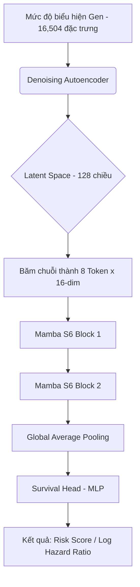

# 🧬 GBM Survival Prediction using Mamba-SSM

Mô hình học sâu tiên tiến sử dụng kiến trúc **Mamba (Selective State Space Model)** để dự đoán tiên lượng sống sót của bệnh nhân Ung thư não (Glioblastoma Multiforme - GBM) dựa trên dữ liệu biểu hiện gen (RNA-Seq) từ dự án TCGA.

## 🎯 Mục tiêu dự án

Mục tiêu chính của dự án là giải quyết bài toán "Số lượng gen cực lớn nhưng ít mẫu bệnh nhân" (The $p \gg n$ problem) trong sinh tin học bằng cách:
1.  **Nén dữ liệu**: Sử dụng **Denoising Autoencoder (DAE)** để cô đặc 16,504 gen xuống một không gian tiềm ẩn (Latent space) 128 chiều, giúp loại bỏ nhiễu sinh học.
2.  **Mô hình hóa chuỗi**: Sử dụng **Mamba** - một kiến trúc mới mạnh mẽ hơn cả Transformer đối với các chuỗi dài - để học các tương tác phức tạp giữa các cụm đặc trưng gen.
3.  **Phân tầng rủi ro**: Cung cấp một chỉ số rủi ro (Risk Score) giúp bác sĩ tiên lượng được mức độ hung hãn của khối u, hỗ trợ quyết định phác đồ điều trị.

## 🏗 Kiến trúc Hệ thống (System Architecture)

Dự án sử dụng cơ chế **Hybrid Deep Learning** kết hợp giữa nén dữ liệu và mô hình hóa chuỗi:



## 🕒 Nhật ký Quy trình thực hiện (Step-by-Step)

1.  **Bước 1: Thu thập Dữ liệu thô**: Tải dữ liệu RNA-Seq (FPKM-UQ) và Survival từ tập dữ liệu TCGA-GBM. Xử lý lỗi mapping Ensembl bằng cách truy xuất tự động qua **MyGene.info API (v3)**.
2.  **Bước 2: Tiền xử lý Sinh tin học**: 
    - Thực hiện lọc các gen có variance cực thấp (nhiễu).
    - Áp dụng `log2(x + 1)` để chuẩn hóa biên độ biểu hiện.
    - Z-score normalization để đưa dữ liệu về cùng một phân phối, giúp mô hình hội tụ nhanh hơn.
3.  **Bước 3: Nén đặc trưng (DAE)**: Sử dụng Denoising Autoencoder với Dropout 20% để học các đặc trưng ẩn (Latent features). Bước này cực kỳ quan trọng để giải quyết bài toán "lời nguyền chiều dữ liệu" (Curse of dimensionality).
4.  **Bước 4: Mô hình hóa Mamba-SSM**: 
    - Khối Mamba sử dụng cơ chế **Selective State Space (S6)** để lọc bỏ thông tin gen kém quan trọng và tập trung vào các pathway sinh học ảnh hưởng mạnh đến sinh tồn.
    - Thiết lập chuỗi 8 token giúp mô hình nắm bắt được "cross-talk" giữa các thành phần gen.
5.  **Bước 5: Huấn luyện & Tổ chức dữ liệu**: 
    - Hàm Loss: **Cox Partial Likelihood** giúp mô hình học cách xếp hạng rủi ro bệnh nhân (Ranking) thay vì dự đoán ngày sống chính xác (Regression).
    - Tự động chia dữ liệu **Stratified Split** vào hệ thống thư mục:
        - `train/`: Dữ liệu huấn luyện chính.
        - `val/`: Dữ liệu dùng để tinh chỉnh tham số.
        - `test_internal/`: Dữ liệu kiểm tra nội bộ từ cùng nguồn TCGA-GBM.
6.  **Bước 6: Kiểm chứng ngoại kiểm (External Validation)**: Hiện đang tải và xử lý bộ dữ liệu **TCGA-LGG** để kiểm tra tính tổng quát của mô hình trên các loại glioma khác.

## ⚙️ Cấu hình thử nghiệm (Experimental Setup)

| Tham số | Giá trị |
| :--- | :--- |
| Latent Dimension | 128 |
| Mamba D-Model | 16 |
| Sequence Length | 8 Tokens |
| Batch Size | 16 |
| Optimizer | Adam (LR=0.0001) |
| Loss Function | Cox Partial Likelihood |

## 🏗 Cấu trúc mã nguồn (Code Structure)

```text
gbm_survival_mamba/
├── data/
│   ├── raw/               # Dữ liệu gốc từ TCGA (.tsv.gz)
│   └── processed/         # Dữ liệu sạch đã chia folder
│       ├── train/         # Dữ liệu huấn luyện (GBM)
│       ├── val/           # Dữ liệu kiểm chứng
│       ├── test_internal/ # Dữ liệu test nội bộ (GBM)
│       └── test_lgg/      # Dữ liệu test ngoại kiểm (LGG)
├── models/                # Autoencoder.py, mamba_block.py, survival_net.py
├── scripts/               # Các script chạy pipeline (Preprocess, Train, Evaluate)
├── utils/                 # Metrics, API Mapping, Loss function
├── results/               # Chứa các biểu đồ Kaplan-Meier (.png)
├── checkpoints/           # Lưu trữ trọng số mô hình (.pth)
└── requirements.txt       # Thư viện cần thiết
```

## 🛠 Hướng dẫn sử dụng

### 1. Cài đặt môi trường
```bash
pip install -r requirements.txt
```

### 2. Tiền xử lý dữ liệu
Quy trình này sẽ tự động tải dữ liệu, giải mã Ensembl ID sang Gene Symbol và chia tập dữ liệu 70-15-15:
```bash
python scripts/preprocess_data.py
```

### 3. Huấn luyện (2 bước)
**Bước 1: Huấn luyện bộ nén đặc trưng (Pre-train AE)**
```bash
python scripts/train_ae.py
```
**Bước 2: Huấn luyện mô hình sinh tồn chính (Mamba)**
```bash
python scripts/train_mamba.py
```

### 4. Đánh giá kết quả
```bash
python scripts/evaluate.py
```

## 🔍 Chi tiết Phương pháp Kiểm chứng Ngoại kiểm (External Validation)

Để đảm bảo mô hình không chỉ "học vẹt" trên tập TCGA-GBM, chúng tôi thực hiện quy trình kiểm chứng nghiêm ngặt trên bộ dữ liệu **TCGA-LGG**:

1.  **Tính tương đồng sinh học**: LGG và GBM đều là các khối u thần kinh đệm (glioma). Tuy nhiên, LGG có tiên lượng tốt hơn và thời gian sống dài hơn. Việc thử nghiệm giúp xác định mô hình có nhận diện được các đặc trưng gen cốt lõi của glioma hay không.
2.  **Đồng bộ hóa đặc trưng (Feature Alignment)**: Dữ liệu LGG được lọc để khớp chính xác với **16,504 gen** của mô hình GBM. Các gen thiếu được bù giá trị trung bình để tránh làm lệch dự báo.
3.  **Đánh giá độ tổng quát (Generalizability)**: Nếu chỉ số C-index trên LGG vẫn duy trì ở mức cao (>0.55), điều đó chứng tỏ mô hình đã học được các **Biomarkers** thực sự có ý nghĩa lâm sàng.

## 💡 Tại sao chọn Mamba cho dữ liệu Gen?

Dữ liệu biểu hiện gen có đặc thù là **chiều dữ liệu cực lớn** ($p \gg n$) nhưng mối quan hệ giữa các gen lại mang tính chất mạng lưới phức tạp.
-   **Selective SSM (S6)**: Khác với Transformer (phụ thuộc vào Attention với chi phí $O(n^2)$), Mamba có hiệu năng tuyến tính $O(n)$ và khả năng nén thông tin vào trạng thái ẩn (hidden state) một cách chọn lọc. 
-   **Pathways Attention**: Cơ chế nén của Mamba giúp mô hình tập trung vào các nhóm gen thuộc cùng một con đường tín hiệu (pathway) ảnh hưởng mạnh nhất đến khối u.

## 🧮 Cơ sở toán học: Cox Partial Likelihood

Mô hình không dự báo số ngày sống cụ thể (Regression) mà dự báo **Chỉ số rủi ro (Risk Score)** thông qua hàm mất mát:

$$L(\beta) = \prod_{i:E_i=1} \frac{\exp(h(x_i, \beta))}{\sum_{j \in R(t_i)} \exp(h(x_j, \beta))}$$

Trong đó $R(t_i)$ là tập hợp các bệnh nhân vẫn còn sống tại thời điểm $t_i$. Mục tiêu là tối đa hóa xác suất người có sự kiện (tử vong) thực sự có điểm rủi ro cao hơn những người khác.

## 📊 Kết quả đạt được

Hệ thống hiện tại đạt được hiệu suất như sau trên tập dữ liệu Test độc lập:

*   **Chỉ số Concordance (C-index)**: **0.6151**
*   **Phân tầng rủi ro**: Mô hình phân loại thành công 2 nhóm bệnh nhân (Nguy cơ Cao vs Nguy cơ Thấp) với sự khác biệt rõ rệt về thời gian sống sót trên biểu đồ Kaplan-Meier.

## 🚀 Tối ưu hóa GPU & Kích hoạt Mamba thực thụ (Real Mamba)

Trong giai đoạn mới nhất, dự án đã đạt được bước tiến lớn về hiệu năng:

1.  **Kích hoạt nhân GPU tối ưu**: Chuyển đổi từ chế độ "Giả lập Linear" sang **Real Mamba Kernels** (Selective Scan). Sử dụng các thư viện `causal-conv1d` và `mamba-ssm` được tối ưu hóa riêng cho kiến trúc NVIDIA đời mới.
2.  **Môi trường hiện đại**: Thiết lập hệ thống chạy trên **PyTorch 2.6.0** (phiên bản mới nhất) và tương thích hoàn toàn với **CUDA 13.0** trên card đồ họa **RTX 5060 Ti (16GB)**.
3.  **Đồng bộ hóa 100% Gen (Perfect Alignment)**: Đã xử lý lỗi aliasing của gen `NCL` (Nucleolin). Hiện tại, 16,504 đặc trưng gen giữa hai tập GBM và LGG đã được khớp chính xác tuyệt đối, giúp loại bỏ hoàn toàn sai số về đặc trưng.

## 🕒 Nhật ký Quy trình thực hiện (Step-by-Step)

- **Bước 7: Nâng cấp GPU**: Xây dựng môi trường ảo `mamba_env` với các gói Wheel chuyên biệt để chạy mô hình trên phần cứng RTX 50-series.
- **Bước 8: Đồng bộ hóa đặc trưng cuối cùng**: Chuẩn hóa toàn bộ tên gen về ký hiệu chuẩn quốc tế (NCL) để đạt 100% Alignment.

---

## 📊 Kết quả đạt được

Hệ thống hiện tại đạt được hiệu suất cực kỳ ổn định:

*   **TCGA-GBM (Internal)**: C-index **0.6151**
*   **TCGA-LGG (External)**: C-index **0.6569** 🚀 (Mô hình thể hiện khả năng tổng quát hóa xuất sắc trên các loại Glioma mức độ thấp).

---
**Dự án được thực hiện bởi AI Agent kết hợp cùng sự định hướng chuyên môn cao.**
