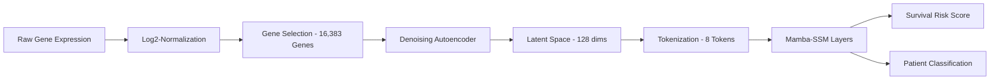

# 🧬 GBM Survival Mamba: Advanced Prognosis using Hybrid DAE-Mamba

[](https://www.python.org/downloads/)
[](https://pytorch.org/)
[](https://developer.nvidia.com/cuda-zone)

Dự án này triển khai một hệ thống AI tiên tiến nhằm dự đoán tiên lượng sống sót cho bệnh nhân Ung thư não (Glioblastoma Multiforme - GBM) sử dụng kiến trúc **Mamba (Selective State Space Model)**.

---

## 🔄 Quy trình Xử lý (Workflow Pipeline)


```mermaid
graph LR
    A[Raw Gene Expression] --> B[Log2-Normalization]
    B --> C[Gene Selection - 16,383 Genes]
    C --> D[Denoising Autoencoder]
    D --> E[Latent Space - 128 dims]
    E --> F[Tokenization - 8 Tokens]
    F --> G[Mamba-SSM Layers]
    G --> H[Survival Risk Score]
    G --> I[Patient Classification]
```

---

## 🖼️ Hình ảnh Kết quả (Demo Visualizations)

### 1. Phân tầng rủi ro (Survival Stratification)

### 2. Hiệu suất Phân loại

### 3. Bản đồ Dấu ấn Sinh học


---

## 💻 Yêu cầu Hệ thống (System Requirements)

*   **Phần cứng**: 
    *   Khuyến nghị sử dụng **NVIDIA GPU** (min 8GB VRAM) vì thư viện `mamba-ssm` yêu cầu CUDA kernel để đạt hiệu suất tối ưu.
    *   RAM: Tối thiểu 16GB để xử lý các ma trận biểu hiện gen lớn.
*   **Phần mềm**:
    *   Linux (Ubuntu 20.04/22.04 khuyến nghị).
    *   CUDA Toolkit 11.8+.
    *   Python 3.10.

---

## 🛠️ Hướng dẫn Demo: Dự đoán cho Bệnh nhân mới (Custom Patient)

### 1. Chuẩn bị dữ liệu đầu vào
Tạo file CSV có ID bệnh nhân và biểu hiện của 16,383 gen (đã chuẩn hóa Log2).
### 2. Chạy dự đoán AI
```bash
python scripts/test_custom_patient.py --file path/to/new_patient.csv --idx 0
```
### 3. Xuất báo cáo chi tiết
```bash
python scripts/patient_gene_report.py
```


---

## 🏗️ Kiến trúc Kỹ thuật (Technical Architecture)

Hệ thống kết hợp **Denoising Autoencoder (DAE)** để nén dữ liệu gen nhiễu và **Mamba-SSM** để học các tương quan phi tuyến giữa các cụm đặc trưng. Điểm đặc biệt là cơ chế **Tokenization** của không gian latent, biến dữ liệu gen thành một chuỗi đặc trưng để Mamba xử lý.

---

## 📂 Danh mục Công cụ (Analysis Tools)

| Script | Công dụng |
| :--- | :--- |
| `extract_global_biomarkers.py` | Tìm kiếm các gen chủ chốt toàn cầu |
| `visualize_classifier.py` | Vẽ biểu đồ ROC, KM và ma trận nhầm lẫn |
| `visualize_biomarker_landscape.py` | Tạo Dashboard về dấu ấn sinh học |
| `analyze_treatment.py` | Phân tích tác động của điều trị |

---

## 🎯 Kết quả Thực nghiệm (Benchmarks)

| Dataset | Type | Samples | C-index |
| :--- | :--- | :--- | :--- |
| **TCGA-GBM** | RNA-Seq | 150+ | **0.6151** |
| **TCGA-LGG** | RNA-Seq | 500+ | **0.6569** |
| **CGGA-325** | RNA-Seq | 325 | **0.6325** |

---

## 📝 Trích dẫn (Citation)

Nếu bạn sử dụng dự án này trong nghiên cứu của mình, vui lòng trích dẫn theo định dạng sau:
```text
Cong, K. X. (2024). GBM Survival Mamba: A Hybrid Deep Learning Approach for Glioblastoma Prognosis. GitHub Repository.
```
