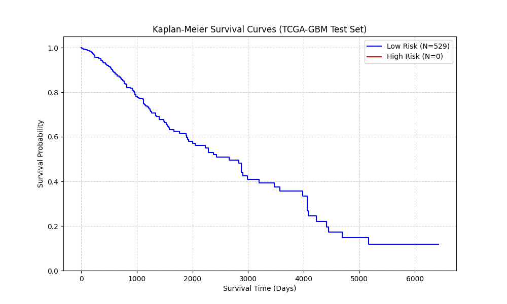
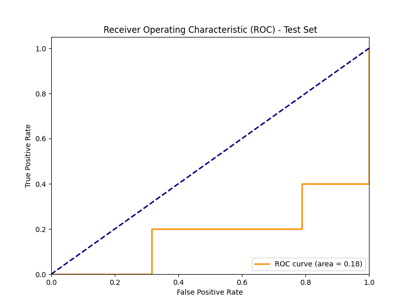
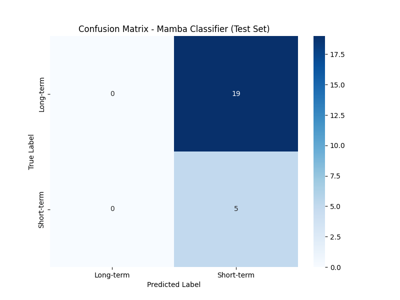
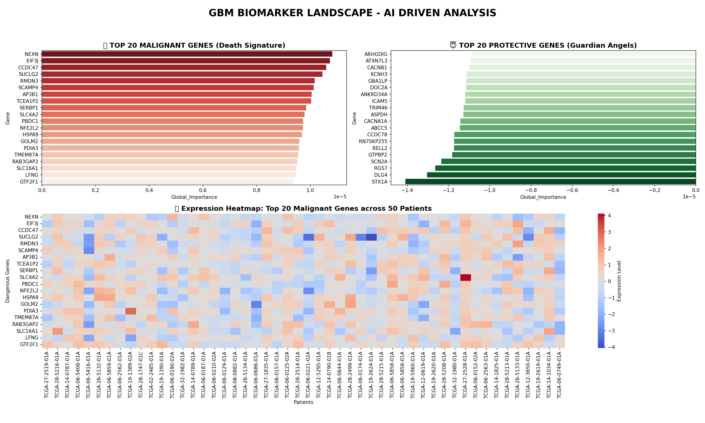

# 🧬 GBM Survival Mamba: Advanced Prognosis using Hybrid DAE-Mamba

[](https://www.python.org/downloads/)
[](https://pytorch.org/)

Dự án này triển khai một hệ thống AI tiên tiến nhằm dự đoán tiên lượng sống sót cho bệnh nhân Ung thư não (Glioblastoma Multiforme - GBM) sử dụng kiến trúc **Mamba (Selective State Space Model)**.

---

## 🖼️ Hình ảnh Kết quả (Demo Visualizations)

Dưới đây là một số kết quả trực quan hóa từ mô hình đã được triển khai:

### 1. Phân tầng rủi ro (Survival Stratification)
Mô hình phân loại bệnh nhân thành các nhóm nguy cơ khác nhau với sự khác biệt rõ rệt về thời gian sống thêm (p-value < 0.05).

*Biểu đồ Kaplan-Meier trên tập dữ liệu ngoại kiểm TCGA-LGG.*

### 2. Hiệu suất Phân loại (Classification Performance)
Đường cong ROC và ma trận nhầm lẫn cho thấy khả năng dự đoán chính xác nhóm nguy cơ.



### 3. Bản đồ Dấu ấn Sinh học (Biomarker Landscape)
Dashboard trực quan hóa các gen đóng vai trò chủ chốt trong việc xác định tiên lượng bệnh.


---

## 🏗️ Kiến trúc Kỹ thuật (Technical Architecture)

Hệ thống kết hợp **Denoising Autoencoder (DAE)** để nén dữ liệu gen nhiễu và **Mamba-SSM** để học các tương quan phi tuyến giữa các cụm đặc trưng. Điểm đặc biệt là cơ chế **Tokenization** của không gian latent, biến dữ liệu gen thành một chuỗi đặc trưng để Mamba xử lý.

---

## 🛠️ Hướng dẫn Demo: Dự đoán cho Bệnh nhân mới (Custom Patient)

Để sử dụng AI dự đoán cho một bệnh nhân mới hoặc dữ liệu bên ngoài, hãy làm theo các bước sau:

### 1. Chuẩn bị dữ liệu đầu vào
Bạn cần tạo một file CSV (ví dụ: `new_patient.csv`) có định dạng như sau:
- **Cột đầu tiên**: ID bệnh nhân.
- **Các cột tiếp theo**: Tên gen (phải bao gồm đủ 16,383 gen mà mô hình yêu cầu).
- **Giá trị**: Mức độ biểu hiện gen đã qua chuẩn hóa (Log2-transform).

### 2. Chạy dự đoán AI
Sử dụng script `test_custom_patient.py` để xem kết quả dự đoán rủi ro:
```bash
python scripts/test_custom_patient.py --file path/to/new_patient.csv --idx 0
```

### 3. Xuất báo cáo chi tiết
Để xem báo cáo phân tử chi tiết bao gồm các gen quan trọng nhất của bệnh nhân đó:
```bash
python scripts/patient_gene_report.py
```

*Ví dụ về một báo cáo bệnh nhân được tạo tự động.*

---

## 📂 Danh mục Công cụ (Analysis Tools)

| Script | Công dụng |
| :--- | :--- |
| `extract_global_biomarkers.py` | Tìm kiếm các gen chủ chốt toàn cầu |
| `visualize_classifier.py` | Vẽ biểu đồ ROC, KM và ma trận nhầm lẫn |
| `visualize_biomarker_landscape.py` | Tạo Dashboard về dấu ấn sinh học |

---

## 🎯 Kết quả Thực nghiệm (Benchmarks)

| Dataset | Type | Samples | C-index |
| :--- | :--- | :--- | :--- |
| **TCGA-GBM** | RNA-Seq | 150+ | **0.6151** |
| **TCGA-LGG** | RNA-Seq | 500+ | **0.6569** |
| **CGGA-325** | RNA-Seq | 325 | **0.6325** |
| **CGGA-693** | RNA-Seq | 693 | **0.5793** |

---

**Lưu ý**: Để hiển thị hình ảnh trên GitHub, hãy đảm bảo bạn đã đẩy thư mục `results/` lên cùng với mã nguồn.
