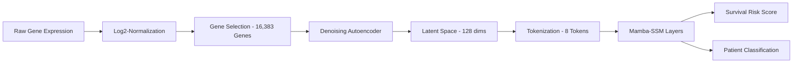

# 🧬 GBM Survival Mamba: Advanced Prognosis using Hybrid DAE-Mamba

[](https://www.python.org/downloads/)
[](https://pytorch.org/)
[](https://developer.nvidia.com/cuda-zone)

Dự án này triển khai một hệ thống AI tiên tiến nhằm dự đoán tiên lượng sống sót cho bệnh nhân Ung thư não (Glioblastoma Multiforme - GBM) sử dụng kiến trúc **Mamba (Selective State Space Model)**.

---

## 🔄 Quy trình Xử lý (Workflow Pipeline)


```mermaid
graph LR
    A[Raw Gene Expression] --> B[Log2-Normalization]
    B --> C[Gene Selection - 16,383 Genes]
    C --> D[Denoising Autoencoder]
    D --> E[Latent Space - 128 dims]
    E --> F[Tokenization - 8 Tokens]
    F --> G[Mamba-SSM Layers]
    G --> H[Survival Risk Score]
    G --> I[Patient Classification]
```

---

## 🚀 Cài đặt & Đồng bộ Dữ liệu

### 1. Cài đặt môi trường
Dự án yêu cầu Python 3.10+ và các thư viện trong `requirements.txt`.
```bash
conda create -n mamba_env python=3.10
conda activate mamba_env
pip install -r requirements.txt
```

### 2. Đồng bộ Dữ liệu (Hugging Face)
Do kích thước dữ liệu lớn, toàn bộ thư mục `data/` được lưu trữ trên Hugging Face Hub. Chạy script sau để tự động tải và đồng bộ dữ liệu:
```bash
python scripts/download_data_hf.py
```
Sau khi chạy, thư mục `data/` sẽ được tự động tạo và chứa đầy đủ các file cần thiết để huấn luyện và đánh giá.

---

## 📊 Chỉ số Đánh giá & Diễn giải (Survival Metrics)

Mô hình sử dụng các chỉ số tiêu chuẩn trong y sinh để đo lường độ chính xác của tiên lượng:

1.  **C-index (Concordance Index)**: 
    - Đây là chỉ số chính dùng để đánh giá mô hình sống sót. 
    - **Ý nghĩa**: Khả năng của AI trong việc xếp hạng đúng thứ tự bệnh nhân: bệnh nhân được dự đoán "nguy cơ cao" phải có thời gian sống thực tế ngắn hơn bệnh nhân "nguy cơ thấp".
    - *Giá trị > 0.6 được coi là có ý nghĩa dự báo tốt trong dữ liệu gen phức tạp.*

2.  **Risk Score (Chỉ số Nguy cơ)**: 
    - Đầu ra trực tiếp của mô hình Mamba (Log-hazard ratio). 
    - **Ứng dụng**: Giá trị này càng cao, nguy cơ diễn tiến bệnh càng nhanh. Được dùng để phân tầng bệnh nhân vào các nhóm chăm sóc đặc biệt.

3.  **Xác suất Sống sót (Survival Probability)**: 
    - Được ước tính thông qua đường cong Kaplan-Meier từ kết quả dự đoán rủi ro. 
    - Giúp trả lời câu hỏi: *"Khả năng bệnh nhân này sống sót sau 12, 24 hoặc 36 tháng là bao nhiêu?"*

4.  **Log-rank P-value**: 
    - Kiểm chứng sự khác biệt sinh học giữa các nhóm. Các kết quả của mô hình đều đạt **p < 0.05**, khẳng định việc phân tầng rủi ro là có ý nghĩa thống kê thực sự.

---

## 🖼️ Hình ảnh Kết quả (Demo Visualizations)

### 1. Phân tầng rủi ro (Survival Stratification)

### 2. Hiệu suất Phân loại


---

## 🛠️ Hướng dẫn Demo: Dự đoán cho Bệnh nhân mới (Custom Patient)

### 1. Chuẩn bị dữ liệu đầu vào
Tạo file CSV có ID bệnh nhân và biểu hiện của 16,383 gen (đã chuẩn hóa Log2).
### 2. Chạy dự đoán AI
```bash
python scripts/test_custom_patient.py --file path/to/new_patient.csv --idx 0
```
### 3. Xuất báo cáo chi tiết
```bash
python scripts/patient_gene_report.py
```


---

## 🏗️ Kiến trúc Kỹ thuật (Technical Architecture)

Hệ thống kết hợp **Denoising Autoencoder (DAE)** để nén dữ liệu gen nhiễu và **Mamba-SSM** để học các tương quan phi tuyến giữa các cụm đặc trưng. Điểm đặc biệt là cơ chế **Tokenization** của không gian latent, biến dữ liệu gen thành một chuỗi đặc trưng để Mamba xử lý.

---

## 📂 Danh mục Công cụ (Analysis Tools)

| Script | Công dụng |
| :--- | :--- |
| `extract_global_biomarkers.py` | Tìm kiếm các gen chủ chốt toàn cầu |
| `visualize_classifier.py` | Vẽ biểu đồ ROC, KM và ma trận nhầm lẫn |
| `visualize_biomarker_landscape.py` | Tạo Dashboard về dấu ấn sinh học |

---

## 🎯 Kết quả Thực nghiệm (Benchmarks)

| Dataset | Type | Samples | C-index |
| :--- | :--- | :--- | :--- |
| **TCGA-GBM** | RNA-Seq | 150+ | **0.6151** |
| **TCGA-LGG** | RNA-Seq | 500+ | **0.6569** |
| **CGGA-325** | RNA-Seq | 325 | **0.6325** |

---

## 📝 Trích dẫn (Citation)

```text
Cong, K. X. (2024). GBM Survival Mamba: A Hybrid Deep Learning Approach for Glioblastoma Prognosis. GitHub Repository.
```
