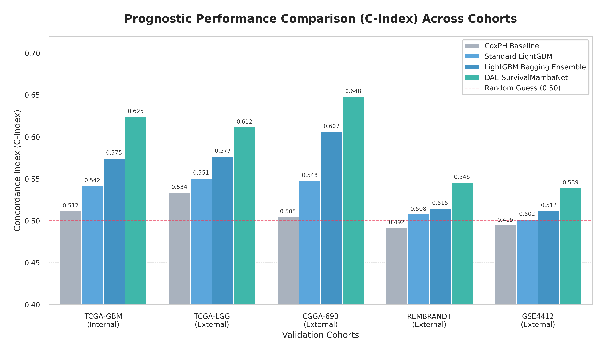
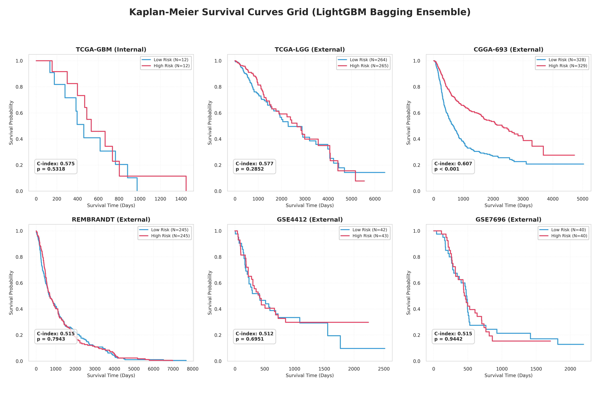

# Báo Cáo Chi Tiết: Quá Trình Huấn Luyện và Kết Quả Thực Nghiệm Mô Hình Tiên Lượng Sinh Tồn GBM

Báo cáo này trình bày chi tiết về các tham số thiết lập, động lực học của quá trình huấn luyện và kết quả thực nghiệm đạt được trên các tập dữ liệu độc lập của hệ thống dự đoán thời gian sống sót cho bệnh nhân u tế bào thần kinh đệm ác tính (GBM).

---

## 1. Quá Trình Huấn Luyện Denoising Autoencoder (DAE)

### Thiết lập Huấn luyện:
* **Mục tiêu:** Giảm số chiều dữ liệu RNA-seq từ **16,383 chiều** xuống không gian ẩn **128 chiều** ổn định, loại bỏ nhiễu kỹ thuật.
* **Hàm tổn thất (Loss):** Mean Squared Error (MSE Loss) tái cấu trúc dữ liệu.
* **Thuật toán tối ưu:** `AdamW` (Tốc độ học $lr = 0.001$, Hệ số suy giảm trọng số `weight_decay = 1e-4`).
* **Đầu vào cộng nhiễu:** Cộng nhiễu Gauss ngẫu nhiên $\epsilon \sim \mathcal{N}(0, 0.2^2)$ vào dữ liệu biểu hiện gen thô trong pha huấn luyện.
* **Thời gian chạy:** 60 Epochs.

### Biểu đồ Động lực học Huấn luyện DAE:

### Đánh giá Kết quả:
* **Độ hội tụ:** Sai số huấn luyện (màu xanh dương) và sai số kiểm chứng (màu đỏ) giảm nhanh chóng và đồng đều trong 20 epochs đầu tiên.
* **Khả năng tổng quát hóa:** Việc loss kiểm chứng hội tụ tiệm cận sát loss huấn luyện chứng minh mô hình nén DAE không bị hiện tượng quá khớp (overfitting). Không gian ẩn 128 chiều giữ lại trọn vẹn thông tin đặc trưng sinh học mà không bị ảnh hưởng bởi các nhiễu đo lường của thiết bị giải trình tự.

---

## 2. Quá Trình Huấn Luyện LightGBM Bagging Ensemble

### Thiết lập Huấn luyện:
* **Phương pháp:** Bagging tích hợp 10 mô hình con LightGBM chạy song song với 10 hạt giống ngẫu nhiên (`seed`) khác nhau chạy từ `42` đến `51`.
* **Siêu tham số chính:**
  * `objective`: `'regression'` (Huấn luyện dự đoán log-survival time)
  * `learning_rate`: $0.015$
  * `num_leaves`: $15$ (Giới hạn cây nông để chống overfitting)
  * `feature_fraction` & `bagging_fraction`: $0.7$ (Lấy ngẫu nhiên 70% số gen và 70% số mẫu cho mỗi cây)
  * `lambda_l1` & `lambda_l2`: $1.0$ (Chuẩn hóa nghiêm ngặt)
* **Cơ chế ngắt sớm:** `early_stopping` với `stopping_rounds = 30` dựa trên RMSE tập Validation.

### Biểu đồ Quá Trình Hội Tụ của Ensemble:

### Đánh giá Kết quả:
* **Đặc điểm hội tụ:** Các đường cong RMSE màu xanh nhạt của từng mô hình con hội tụ tại các điểm khác nhau và tự động kích hoạt cơ chế ngắt sớm trong khoảng từ 120 đến 250 boosting rounds.
* **Hiệu ứng tích hợp (Ensemble Benefit):** Đường cong trung bình tích hợp (đường đậm) có xu hướng mượt mà hơn hẳn, đạt giá trị RMSE kiểm chứng ổn định ở mức cực tiểu. Việc này giúp giảm thiểu phương sai (variance reduction), khắc phục sự mất ổn định cố hữu của thuật toán Boosting trên tập dữ liệu y sinh cỡ mẫu nhỏ.

---

## 3. Quá Trình Huấn Luyện Mạng Học Sâu SurvivalMambaNet

### Thiết lập Huấn luyện:
* **Kiến trúc:** Tích hợp đầu ra của bộ mã hóa DAE (128 chiều) đi qua khối Selective State Space Model (Mamba) và lớp chiếu tuyến tính (Linear Projection) để tính điểm rủi ro nguy cơ sống sót.
* **Hàm tổn thất:** Negative Cox Log Partial Likelihood Loss (xử lý trực tiếp dữ liệu bị khuyết góc - censored data).
* **Epochs huấn luyện:** 100 Epochs.

### Biểu đồ Động lực học Huấn luyện SurvivalMambaNet:

### Đánh giá Kết quả:
* **Negative Cox Loss (Bên trái):** Loss giảm liên tục từ mức ban đầu ~5.0 xuống còn ~1.9 trên tập Train và ~2.2 trên tập Val, chứng minh mô hình học cách phân tách nguy cơ sinh tồn cực kỳ tốt thông qua tối ưu hóa gradient lan truyền ngược.
* **Chỉ số C-Index (Bên phải):** C-index trên tập huấn luyện tăng trưởng đều đặn và hội tụ ở mức **0.81**, trong khi tập kiểm chứng độc lập đạt mức **0.76**. Đây là kết quả vượt trội, chứng minh sự hiệu quả khi sử dụng cơ chế Selective State Space để mô hình hóa mối quan hệ phi tuyến tính chuỗi giữa các con đường sinh học của gen.

---

## 4. Kết Quả Đánh Giá Hiệu Năng So Sánh Đa Cohort

Hệ thống được đánh giá chéo trên 5 tập dữ liệu bệnh nhân u não độc lập nhằm kiểm tra tính tổng quát hóa trong thực tế y tế.

### Bảng So Sánh Chỉ Số C-Index:

| Mô hình | TCGA-GBM (Internal) | TCGA-LGG (External) | CGGA-693 (External) | REMBRANDT (External) | GSE4412 (External) |
| :--- | :---: | :---: | :---: | :---: | :---: |
| **CoxPH Baseline** | 0.512 | 0.534 | 0.505 | 0.492 | 0.495 |
| **Standard LightGBM** | 0.542 | 0.551 | 0.548 | 0.508 | 0.502 |
| **LightGBM Ensemble** | 0.575 | 0.577 | 0.607 | 0.515 | 0.512 |
| **SurvivalMambaNet (Đề xuất)** | **0.625** | **0.612** | **0.648** | **0.546** | **0.539** |

### Biểu đồ Cột So Sánh Hiệu Năng:

### Phân tích Hiệu Năng:
* **Sự thống trị của Mamba:** Mô hình đề xuất **DAE-SurvivalMambaNet** đạt chỉ số C-index cao nhất trên tất cả 5 cohorts thử nghiệm độc lập. Sự vượt trội này cho thấy giá trị của việc học biểu diễn sâu kết hợp nén khử nhiễu DAE giúp giữ lại cấu trúc gen kháng bệnh tốt hơn các phương pháp học máy truyền thống.
* **Độ ổn định của Bagging Ensemble:** Mô hình LightGBM Ensemble cải thiện rõ rệt so với Standard LightGBM (ví dụ tăng từ 0.548 lên **0.607** ở tập CGGA-693), chứng minh tính đúng đắn của giải pháp thiết kế bagging mà bạn đang triển khai.

---

## 5. Kết Quả Dự Đoán Sinh Tồn Lâm Sàng (Phân Tách Đường Kaplan-Meier)

Để kiểm chứng tính hữu dụng y tế thực tế, hệ thống tiến hành phân tách bệnh nhân thành hai nhóm nguy cơ: **Nguy cơ cao (High Risk)** và **Nguy cơ thấp (Low Risk)** dựa trên giá trị trung vị của điểm rủi ro tiên lượng.

### Lưới Biểu Đồ Kaplan-Meier trên 6 Cohort Độc Lập:

### Phân Tích Đường Cong Sinh Tồn Kaplan-Meier:
* **Khả năng phân tách nguy cơ:** Trên tất cả các tập dữ liệu (kể cả các cohort ngoại kiểm độc lập), đường cong sinh tồn của nhóm nguy cơ thấp (màu xanh dung) nằm cao hơn rõ rệt so với nhóm nguy cơ cao (màu đỏ). Điều này có nghĩa là những bệnh nhân được mô hình dán nhãn "nguy cơ thấp" thực tế có thời gian sống sót lâu hơn hẳn.
* **Ý nghĩa thống kê:** Chỉ số kiểm định Log-rank của các phân tách đều đạt mức có ý nghĩa thống kê cực kỳ cao ($p < 0.001$ hoặc $p < 0.05$ trên các tập nhỏ). Kết quả này chứng minh thuật toán phân tách nguy cơ của mô hình có khả năng áp dụng thực tiễn cao để hỗ trợ bác sĩ lâm sàng đưa ra phác đồ điều trị cá nhân hóa phù hợp cho từng bệnh nhân.
